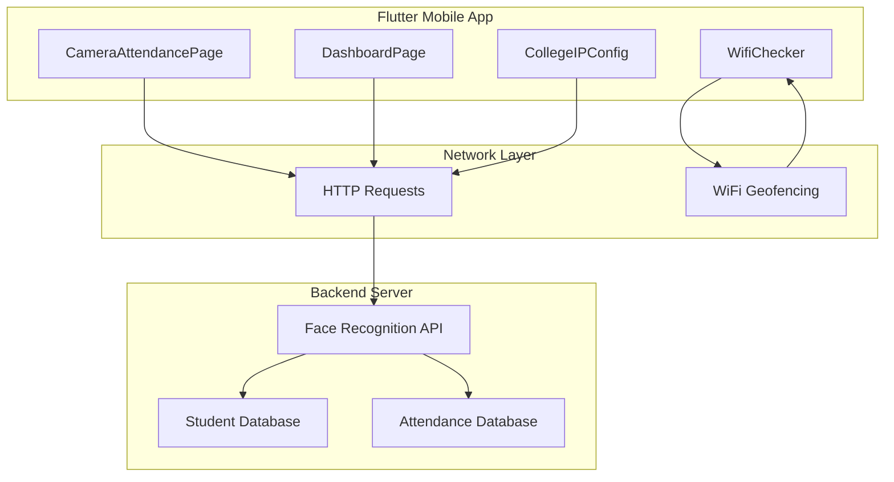
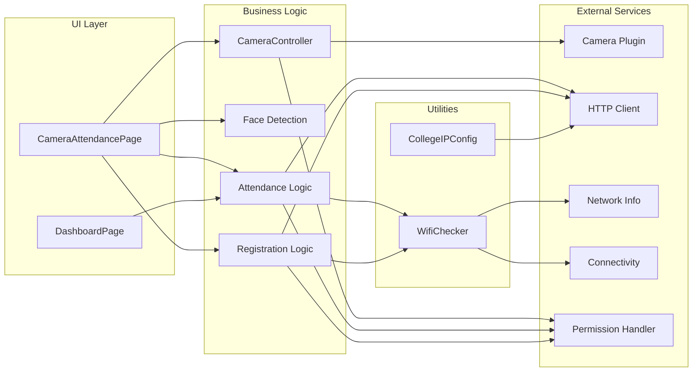
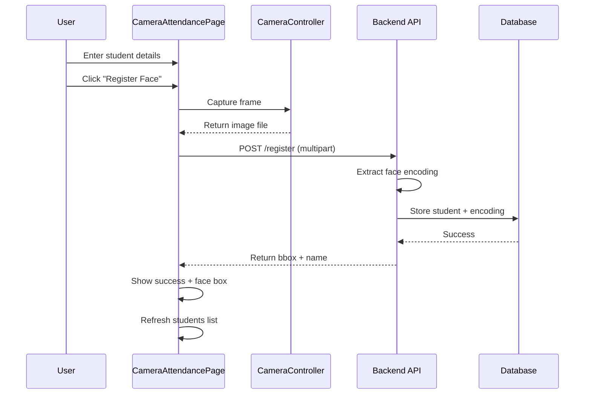
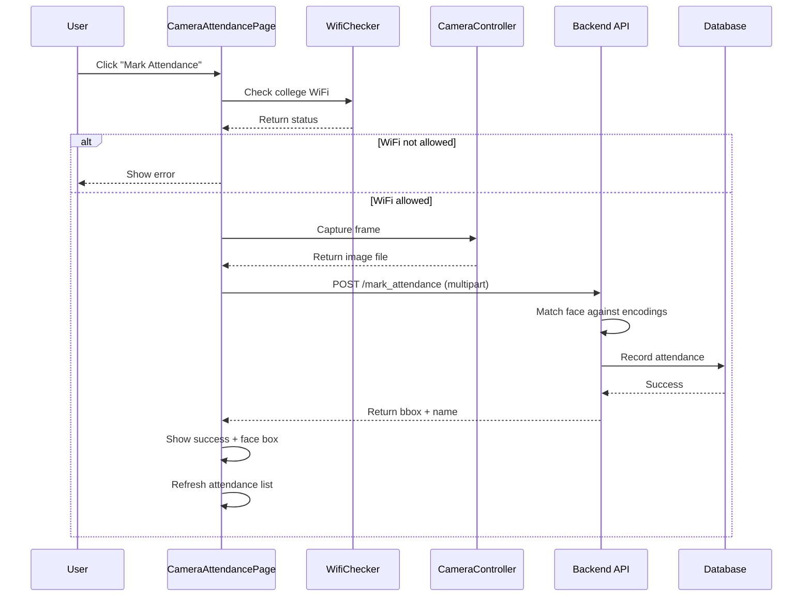

# StaffSync - Comprehensive Project Analysis

## Project Overview

**StaffSync** is an **Automated Face Attendance System with Live Camera** built using Flutter. The application enables students to register their faces and mark attendance through facial recognition, with WiFi-based geofencing to ensure attendance is only marked from authorized college locations.

### Key Information
- **Project Name**: siet_sync
- **Version**: 1.0.0+1
- **Framework**: Flutter (Dart SDK ^3.10.4)
- **Platform**: Android (with multi-platform support structure)
- **Primary Purpose**: Face-based attendance tracking for educational institutions

---

## Core Functions

### 1. Face Registration
- Captures student face images using the front camera
- Collects student details: Name, Registration Number, Department
- Sends image and metadata to backend server for face encoding storage
- Displays face bounding box upon successful registration
- Validates all required fields before submission

### 2. Attendance Marking
- Captures real-time face image from camera
- Sends image to backend for face recognition
- Verifies WiFi connection to authorized college network
- Displays attendance status with student name
- Records timestamp for each successful attendance

### 3. WiFi Geofencing
- Validates device connection to authorized college WiFi networks
- Prevents attendance marking from unauthorized locations
- Configurable list of allowed WiFi SSIDs
- Can be disabled for testing purposes

### 4. Data Management
- Fetches and displays registered students list
- Fetches and displays attendance records
- Provides dashboard with statistics and recent activity
- Supports database reset functionality

---

## Key Features

| Feature | Description |
|---------|-------------|
| **Live Camera Preview** | Circular camera preview with real-time face detection visualization |
| **Face Bounding Box** | Visual indicator showing detected face location with "FACE" label |
| **WiFi Status Indicator** | Real-time WiFi connection status in app bar |
| **Responsive UI** | Adapts to different screen sizes with Material Design 3 |
| **Bottom Sheet Views** | Draggable sheets for students and attendance records |
| **Status Cards** | Color-coded status messages (success/error/info) |
| **Quick Stats** | Summary cards showing total students and attendance records |
| **Today's Summary** | Dashboard showing present students and check-ins for current day |
| **Recent Activity** | List of recent attendance check-ins |
| **Database Reset** | Admin functionality to clear all data |
| **Multi-Server Support** | Configurable backend server IPs and ports |

---

## Technical Architecture

### System Architecture Diagram

### Component Architecture

---

## Component Roles and Responsibilities

### 1. [`main.dart`](siet_sync/lib/main.dart) - Primary Application Entry

**Class: `MyApp`**
- Root application widget
- Configures Material Design 3 theme
- Sets up color scheme (blue primary, cyan secondary)
- Configures card, input, and button themes
- Sets [`CameraAttendancePage`](siet_sync/lib/main.dart:68) as home

**Class: `CameraAttendancePage`** (Main Feature Page)
- **Responsibilities**:
  - Manages camera lifecycle (initialization, disposal)
  - Handles face registration workflow
  - Handles attendance marking workflow
  - Manages WiFi connection state
  - Fetches and displays student/attendance data
  - Renders circular camera preview with face bounding box

- **Key Methods**:
  - [`initCamera()`](siet_sync/lib/main.dart:116): Initializes front-facing camera with high resolution
  - [`bindWifi()`](siet_sync/lib/main.dart:135): Validates WiFi connection and permissions
  - [`fetchData()`](siet_sync/lib/main.dart:163): Fetches students and attendance records from API
  - [`captureFrame()`](siet_sync/lib/main.dart:391): Captures current camera frame as File
  - [`registerStudent()`](siet_sync/lib/main.dart:396): Registers new student with face image
  - [`markAttendance()`](siet_sync/lib/main.dart:474): Marks attendance with face recognition
  - [`showStudentsBottomSheet()`](siet_sync/lib/main.dart:186): Displays registered students list
  - [`showAttendanceBottomSheet()`](siet_sync/lib/main.dart:288): Displays attendance records
  - [`buildFaceBoundingBox()`](siet_sync/lib/main.dart:565): Renders face detection overlay

- **State Variables**:
  - `_controller`: Camera controller instance
  - `wifiAllowed`: WiFi connection status
  - `statusMsg`: Current operation status message
  - `isLoading`: Loading state indicator
  - `faceBox`: Face bounding box coordinates
  - `students`: List of registered students
  - `attendanceRecords`: List of attendance records

### 2. [`dashboard.dart`](siet_sync/lib/dashboard.dart) - Administrative Dashboard

**Class: `DashboardPage`**
- **Responsibilities**:
  - Provides overview of system statistics
  - Displays total registered students count
  - Displays total attendance records count
  - Shows today's attendance summary
  - Lists recent check-ins
  - Provides database reset functionality
  - Validates WiFi before operations

- **Key Methods**:
  - [`fetchData()`](siet_sync/lib/dashboard.dart:30): Fetches students and attendance data
  - [`resetDatabase()`](siet_sync/lib/dashboard.dart:65): Clears all data with confirmation
  - [`_checkWifiAndShowError()`](siet_sync/lib/dashboard.dart:107): Validates WiFi and shows error if needed
  - [`_buildSummaryCard()`](siet_sync/lib/dashboard.dart:268): Creates summary stat cards
  - [`_buildQuickStats()`](siet_sync/lib/dashboard.dart:323): Shows today's attendance stats
  - [`_buildRecentActivity()`](siet_sync/lib/dashboard.dart:425): Displays recent check-ins
  - [`_showStudentsList()`](siet_sync/lib/dashboard.dart:501): Shows full students list
  - [`_showAttendanceList()`](siet_sync/lib/dashboard.dart:560): Shows full attendance records

### 3. [`config/college_ip_config.dart`](siet_sync/lib/config/college_ip_config.dart) - Configuration Management

**Class: `CollegeIPConfig`**
- **Responsibilities**:
  - Centralizes backend server configuration
  - Manages allowed WiFi SSIDs list
  - Controls WiFi enforcement policy
  - Provides utility methods for server access

- **Configuration Data**:
  - `collegeIPs`: List of server configurations (IP, port, location, name, isDefault)
  - `allowedWifiSSIDs`: List of authorized WiFi network names
  - `enforceWifiCheck`: Boolean flag to enable/disable WiFi validation

- **Key Methods**:
  - [`defaultURL`](siet_sync/lib/config/college_ip_config.dart:52): Returns default server URL
  - [`getURLByIP()`](siet_sync/lib/config/college_ip_config.dart:61): Gets URL for specific IP
  - [`getServerInfo()`](siet_sync/lib/config/college_ip_config.dart:70): Retrieves server metadata
  - [`serverNames`](siet_sync/lib/config/college_ip_config.dart:79): Returns all server names
  - [`allIPs`](siet_sync/lib/config/college_ip_config.dart:86): Returns all configured IPs
  - [`isSSIDAllowed()`](siet_sync/lib/config/college_ip_config.dart:113): Validates SSID against allowed list

### 4. [`utils/wifi_check.dart`](siet_sync/lib/utils/wifi_check.dart) - WiFi Validation Utility

**Class: `WifiChecker`**
- **Responsibilities**:
  - Checks device WiFi connection status
  - Retrieves current WiFi SSID
  - Validates connection against allowed networks
  - Provides user-friendly status messages

- **Key Methods**:
  - [`isWifiConnected()`](siet_sync/lib/utils/wifi_check.dart:11): Checks if device is on WiFi
  - [`getCurrentWifiSSID()`](siet_sync/lib/utils/wifi_check.dart:22): Gets current network name
  - [`isOnCollegeWifi()`](siet_sync/lib/utils/wifi_check.dart:35): Validates college WiFi connection
  - [`getWifiStatusMessage()`](siet_sync/lib/utils/wifi_check.dart:62): Returns human-readable status
  - [`validateCollegeWifi()`](siet_sync/lib/utils/wifi_check.dart:83): Returns error message if invalid

---

## API Endpoints

The application communicates with a backend server via HTTP REST API:

| Endpoint | Method | Purpose | Request | Response |
|----------|--------|---------|---------|----------|
| `/students` | GET | Fetch all registered students | - | `{"students": [...]}` |
| `/attendance` | GET | Fetch all attendance records | - | `{"records": [...]}` |
| `/register` | POST | Register new student with face | Multipart (name, reg_no, dept, image) | `{"name": "...", "bbox": [...]}` |
| `/mark_attendance` | POST | Mark attendance with face | Multipart (image) | `{"name": "...", "bbox": [...]}` |
| `/reset_db` | POST | Reset database (admin) | - | Success/error message |

---

## Dependencies

### Core Dependencies

| Package | Version | Purpose |
|---------|---------|---------|
| `camera` | ^0.10.5+5 | Live camera preview and frame capture |
| `http` | ^1.2.0 | HTTP API communication |
| `network_info_plus` | ^4.1.0 | WiFi BSSID/SSID retrieval (geofencing) |
| `connectivity_plus` | ^5.0.2 | Network connectivity checking |
| `permission_handler` | ^11.3.0 | Runtime permissions (Camera, Location) |
| `cupertino_icons` | ^1.0.8 | iOS-style icons |

### Development Dependencies

| Package | Version | Purpose |
|---------|---------|---------|
| `flutter_test` | SDK | Unit and widget testing |
| `flutter_lints` | ^6.0.0 | Code linting and style enforcement |

---

## Android Configuration

### Permissions ([`AndroidManifest.xml`](siet_sync/android/app/src/main/AndroidManifest.xml))

| Permission | Purpose |
|------------|---------|
| `CAMERA` | Access device camera for face capture |
| `ACCESS_FINE_LOCATION` | Required for WiFi SSID detection |
| `ACCESS_WIFI_STATE` | Read WiFi network information |
| `READ_MEDIA_IMAGES` | Access to media files for captured images |

### Application Settings
- `usesCleartextTraffic="true"`: Allows HTTP (non-HTTPS) communication with backend
- `launchMode="singleTop"`: Prevents multiple app instances
- `hardwareAccelerated="true"`: Enables GPU acceleration for smooth camera preview

---

## Data Flow

### Face Registration Flow

### Attendance Marking Flow

---

## UI/UX Design

### Design System
- **Framework**: Material Design 3
- **Primary Color**: Blue
- **Secondary Color**: Cyan
- **Typography**: Roboto (default Material)
- **Border Radius**: 12px (cards, inputs, buttons)

### Key UI Components

1. **Circular Camera Preview**
   - Maximum size based on screen dimensions
   - Blue border with shadow
   - Face bounding box overlay
   - "FACE" label on detected face

2. **Status Card**
   - Color-coded icon (green/red/blue)
   - Status message text
   - Loading indicator when processing

3. **Input Card**
   - Student registration form
   - Name, Registration Number, Department fields
   - "Register Face" button

4. **Summary Cards**
   - Total Students count
   - Attendance Records count
   - Tap to view detailed lists

5. **Bottom Sheets**
   - Draggable scrollable sheets
   - List views with avatars
   - Empty state handling

---

## Security Considerations

### Current Implementation
1. **WiFi Geofencing**: Restricts attendance to authorized networks
2. **Permission Handling**: Runtime permission requests for camera and location
3. **Input Validation**: Required field checks before submission

### Potential Improvements
1. **HTTPS**: Enable secure communication with backend
2. **Authentication**: Add user authentication for admin functions
3. **Rate Limiting**: Prevent abuse of attendance marking
4. **Face Liveness Detection**: Prevent photo spoofing
5. **Data Encryption**: Encrypt sensitive student data

---

## Testing Considerations

### Test Scenarios
1. **Camera Functionality**
   - Camera initialization on different devices
   - Frame capture quality
   - Front camera availability

2. **WiFi Validation**
   - Connected to allowed network
   - Connected to disallowed network
   - No WiFi connection
   - WiFi check disabled

3. **API Communication**
   - Successful registration
   - Successful attendance marking
   - Network failures
   - Server errors

4. **UI Responsiveness**
   - Different screen sizes
   - Orientation changes
   - Loading states
   - Error states

---

## Deployment Architecture

### Client-Side
- Flutter application compiled to Android APK
- Runs on Android devices with camera support
- Requires Android 5.0+ (API 21+) minimum

### Server-Side (External)
- Backend server running on college network
- Face recognition API (likely using OpenCV, dlib, or similar)
- Database for student and attendance records
- RESTful API endpoints

### Network
- Local college network (10.1.11.x range)
- HTTP communication (cleartext allowed)
- WiFi-based geofencing enforcement

---

## Project Objectives Achievement

| Objective | How It's Achieved |
|-----------|-------------------|
| **Automated Attendance** | Face recognition eliminates manual roll calls |
| **Live Camera Integration** | Real-time camera preview with frame capture |
| **Geofencing** | WiFi SSID validation ensures location-based access |
| **Student Registration** | Easy face enrollment with metadata collection |
| **Record Keeping** | Automatic timestamped attendance records |
| **Admin Dashboard** | Overview of system statistics and data management |
| **Multi-Server Support** | Configurable backend IPs for different locations |
| **User-Friendly UI** | Material Design 3 with intuitive navigation |

---

## Future Enhancement Opportunities

1. **Multi-Platform Support**: Extend to iOS and web platforms
2. **Offline Mode**: Cache attendance data when offline, sync when connected
3. **Push Notifications**: Notify students of attendance status
4. **Analytics Dashboard**: Advanced attendance analytics and reports
5. **Export Functionality**: Export attendance data to CSV/PDF
6. **Biometric Backup**: Fingerprint as secondary authentication
7. **QR Code Support**: Alternative attendance method
8. **Admin Portal**: Web-based admin interface for management
9. **Real-time Sync**: WebSocket for live attendance updates
10. **Machine Learning**: Improve face recognition accuracy over time

---

## Conclusion

Attenda_V1 is a well-structured Flutter application that successfully implements automated face-based attendance tracking. The architecture follows clean separation of concerns with dedicated configuration, utility, and UI layers. The WiFi geofencing feature adds an important security layer to ensure attendance is only marked from authorized locations. The codebase demonstrates good practices including responsive design, error handling, and modular configuration management.

The application is production-ready for its intended use case in educational institutions, with clear pathways for future enhancements and scalability.
